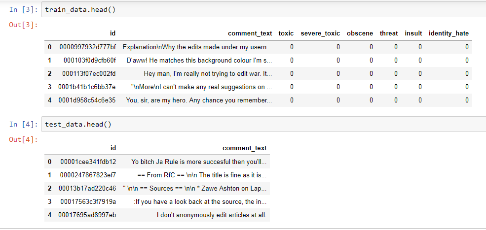
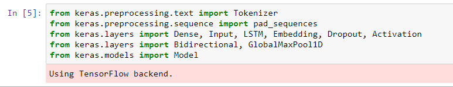
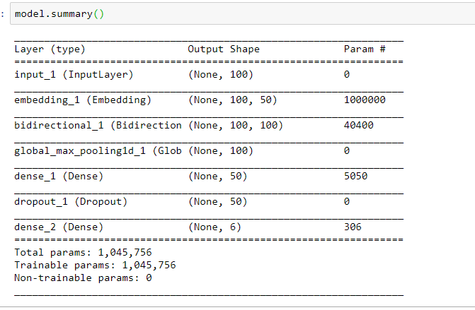
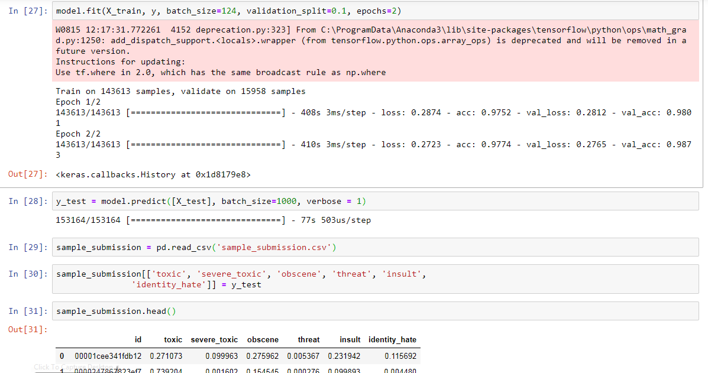

# __toxic_comment_classification_challenge__

This project is from Kaggle and its problem statememt is as follows:

The threat of abuse and harassment online means that many people stop expressing themselves and give up on seeking different opinions. Platforms struggle to effectively facilitate conversations, leading many communities to limit or completely shut down user comments.
we are challenged to build a multi-headed model that’s capable of detecting different types of of toxicity like threats, obscenity, insults, and identity-based hate better than Perspective’s current models.

### About Data:

we have 3 files:
1. train.csv --> (159571, 8)
2. test.csv  --> (153164, 2)
3. Sample_submission.

**Columns** :

id 
comment_text
"toxic 
severe_toxic
obscene
threat
insult
identity_hate"

**Libraries used**:

My initial attempt is to use LSTM directly to see how effective was that approach is. In this project i used GLoVe pretrained weights to build the model. Due to memory contrains i fitted for only 2 epochs, with only 2 fully connected layers and a Dropout.

**Model Summary**:

**Accuracy**:

Got an accuracy of 97% with 2 epochs, Accuracy can be increased if we use early stopping and allow our model to run upto it reaches a threshold.
